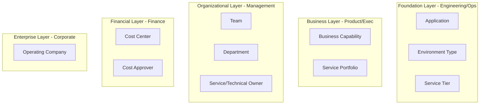

# Rule-Based Dimensions (RBD) Demo - Allocation Strategy

This document outlines the allocation strategy, dimension hierarchy, and specific scenarios implemented in the [`rbd_demo_env.pt`](rbd_demo_env.pt) policy template.

## Key Scenarios

The policy creates and manages Rule-Based Dimensions to showcase an **Application-Centric Allocation Strategy**.

### Primary Key = Application

The `Application` dimension is the single source of truth. It is assigned at the cloud account level (simulating a tag or registration process).

### Cloud Account / Resource Groups Tags are baseline allocation strategy

Cloud Accounts (and "Resource Groups" on Azure) are used by Engineering/FinOps to organize applications. New applications/workloads must provide `Application` and `Environment Type` to be approved and have a cloud tenant allocated to run infrastructure.

### Automated Enrichment (CMDB)

`Application` is mapped from Cloud Account, Resource Group tags. The policy automatically manages mapping rules for all other dimensions (Business, Organizational, Financial) based on a simulated CMDB (ServiceNow) lookup.

The policy template demonstrates how we can retrieve mappings from CMDB and have left the functional code in the Policy Template to give a high level of transparency into how this outcome is accomplished in a real-world environment.

### "Healthy" Allocation Coverage

With the above control over "Cloud Tenants" and automated allocation logic, we aim to showcase that high coverage is achievable with minimal manual effort by centralized FinOps team.

#### Imperfect Environment

The demo environment intentionally includes unallocated costs for the "youngest" cloud account in order to represent a more realistic environment.  The youngest cloud account is determined based on the min(timestamp) and max(timestamp) for costs for each cloud account.  To be considered "youngest" the cloud account must have costs in the current/previous month AND created most recently.

This is helpful when considering potential automatic notifications for Unallocated costs, investigating source of unallocated costs, and remediating them by either tagging resource(s) or adding rules to the RBD (can't be tagged, incorrectly tagged).

### Improved Allocation Coverage and Accuracy

`Application` dimension has rules defined by FinOps team which work in addition to Cloud Tenant tag based allocation to allocate costs that are unallocated i.e. not tagged, can't be tagged (coverage), or incorrectly allocated (accuracy).

## Dimension Hierarchy

The dimensions are layered to serve specific personas within the organization.

| Layer | Persona | Dimensions | Description |
| :--- | :--- | :--- | :--- |
| **Foundation** | Engineering / Ops | `Application` `Environment Type` `Service Tier` | Core technical entities and lifecycle stages (e.g., "Customer Portal", "Production"). |
| **Business** | Product / Exec | `Business Capability` `Service Portfolio` | Functional domains and strategic groupings (e.g., "Customer Experience", "Digital Front Office"). |
| **Organizational** | Management | `Team` `Department` `Service Owner` | Accountability and organizational structure (e.g., "Team One", "Engineering"). |
| **Financial** | Finance | `Cost Center` `Cost Approver` | Budgeting and accounting codes (e.g., "CC-111"). |
| **Enterprise** | Corporate | `Operating Company` | Legal entities (e.g., "BuyerCorp Inc."). |
